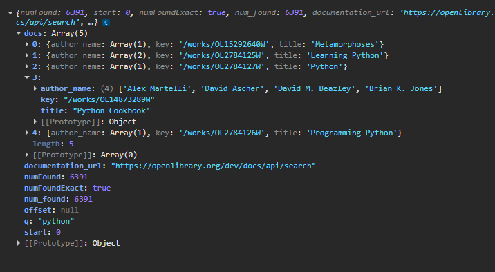
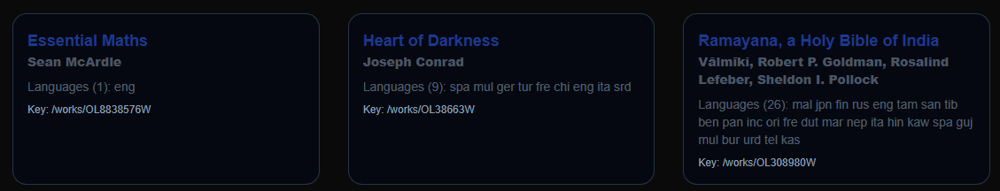

# 1. Estructura del proyecto


## Crear las carpetas y su contenido

Crear las carpetas de la figura anterior y los archivos vacíos dentro de cada una de las mismas.

* `/app/api`
* `/components/`
* `/lib/` 
* `/types/`


# 2. Escribir archivo /types/book.ts (10%)

## Crear cuenta en openlibrary

La URL es: https://openlibrary.org/ usando tu correo electrónico, al hacerlo  reemplaza **tucorreo@gmail.com** por el que hayas registrado en el siguiente código.

* Usa la consola de tu navegador y con tu correo y analiza la respuesta.

```js
const url = "https://openlibrary.org/search.json?q=python&limit=5&fields=key,title,author_name";
const headers = new Headers({
    "User-Agent": "MyAppName/1.0 (tucorreo@gmail.com)"
});
const options = {
    method: 'GET',
    headers: headers
};
fetch(url, options)
    .then(response => response.json())
    .then(data => console.log(data))
    .catch(error => console.error('Error:', error));

````

Deberás tener una salida como la siguiente:



Después de analizar el código escribe el código para `types/book.ts` y completa los espacios faltantes como `_______`.

```ts
export interface Book {
    key: string;
    title: string;
    author_name?: string[];
    language?: _______;
    edition_count?: _______;
}
```
(deberás completar los espacios faltantes)

Los datos esperados deberán lucir en la version final de la siguiente manera:




# 3. Carpeta lib/ (10%)

* En los siguientes archivos agregar los `import` que sean necesarios. 

## archivo constants.ts

* Cambiar **tucorreo@gmail.com** por el tuyo.

```ts
export const OPEN_LIBRARY_BASE_URL = "https://openlibrary.org/search.json";

export const OPEN_LIBRARY_USER_AGENT =
    "MyAppName/1.0 (tucorreo@gmail.com)";

export const SEARCH_FIELDS = [
    "key",
    "title",
    "author_name",
    "editions",
    "edition_count",
    "language"
];

export const SEARCH_LIMIT = 5;

export const VALID_AREAS:string [] = [
    "algebra",
    "math",
    "python",
];

export type Area = typeof VALID_AREAS[number];
```

## archivo openLibrary.ts
* Cambiar **tucorreo@gmail.com** por el tuyo.
* Agregrar **async await** en donde corresponda

El objetivo es tener una función que pida libros a la API.

```ts

const BASE_URL = "https://openlibrary.org/search.json";
const USER_AGENT = "MyAppName/1.0 (tucorreo@gmail.com)";

export  function searchBooks(area: string): Promise<Book[]> {
    const params = new URLSearchParams({
        q: area,
        limit: "10",
        fields: "key,title,author_name,editions,language,edition_count",
    });


    const response =  fetch(`${BASE_URL}?${params.toString()}`, {
        headers: {
            "User-Agent": USER_AGENT,
        },
        next: { revalidate: 3600 },
    });

    if (!response.ok) {
        throw new Error("Error cargando información");
    }

    const data =  response.json();

    console.log(data);
    return data.docs;
}
```


# 4. Carpeta components/books

## Archivo components\books\BookCard.tsx (20%)

* Agregar la lista de lenguajes disponibles de los libros en `book.language?.map _____`
* Agregar el resto de elementos faltantes marcados con _____ 

```ts

export default function BookCard({ book }: { book: Book }) {
  return (
    <div className="bg-gray-950/70  rounded-2xl shadow border-1 border-slate-700/75  p-4">
      <h2 className="font-bold text-lg text-blue-900">{ ___________ }</h2>
      <p className="text-sm text-gray-600 font-extrabold">
        {book.author_name?.join(", ") || "Unknown author"}
      </p>

      <p className="text-sm mt-2 text-slate-400/55">
        Languages ({book.language?.length || 0}):
        {
          book.language?.map(  _______ )
        }
      </p>

      <p className="text-xs text-slate-400 mt-2">
        Key: { ________ }
      </p>
    </div>
  );
}

```

## Archivo components\books\BookList.tsx (10%)
* Agregar elementos faltantes marcados con _____ 


```ts
export default function BookList({ books }: { books: Book[] }) {
  return (
    <div className="grid md:grid-cols-2 lg:grid-cols-3 gap-8">
      {books.map((book) => (
        <BookCard key={book.__________} book={book} />
      ))}
    </div>
  );
}

```

# Modificar archivo MainNav.tsx  (10%)
* Recordar que al usarse el hook usePathname, este componente debe ser un componente de tipo **cliente** y no  de tipo **servidor**.
* recuerda agregar las dependencias de **imports**.
* reemplazar @@@@@@@@@ por la ruta obtenida por el hook,

```ts
"use ______";

export default function MainNav() {
  const pathname = usePathname();

  return (
    <nav className="bg-slate-800 shadow">
      <div className="max-w-6xl mx-auto flex gap-6 p-4">
        {VALID_AREAS.map((area) => {
          const isActive = @@@@@@@@@ === `/api/${area}`;
          return (
            <Link
              key={area}
              href={`/api/${area}`}
              className={`capitalize border-b-2 font-medium bg-slate-700 px-8 py-2 rounded-2xl ${
                isActive
                  ? "text-blue-400  border-blue-600"
                  : "text-gray-400  border-blue-400/50"
              }`}
            >
              {area}
            </Link>
          );
        })}
      </div>
    </nav>
  );
}

```

# Modificar archivo layout.tsx (10%)

* En ____ agregar el componente  MainNav y el import adecuado.

```ts
import type { Metadata } from "next";
import { Geist, Geist_Mono } from "next/font/google";
import "./globals.css";

const geistSans = Geist({
  variable: "--font-geist-sans",
  subsets: ["latin"],
});

const geistMono = Geist_Mono({
  variable: "--font-geist-mono",
  subsets: ["latin"],
});

export const metadata: Metadata = {
  title: "API openlibrary",
  description: "Usando openlibrary API",
};

export default function RootLayout({
  children,
}: Readonly<{
  children: React.ReactNode;
}>) {
  return (
    <html lang="en">
      <body
        className={`${geistSans.variable} ${geistMono.variable} antialiased  min-h-screen `}
      >
        <main className="max-w-6xl mx-auto p-6">
          ___________

          {children}
        </main>
      </body>
    </html>
  );
}

```


# Usar el siguiente archivo globals.css
* Copiar el archivo directamente.
* Este archivo no requiere cambios.

```css
@import "tailwindcss";

:root {
  --background: #f3f4f6;
  --foreground: #111827;
  --primary: #2563eb;
  --radius: 0.75rem;
}

html {
  scroll-behavior: smooth;
}


@theme inline {
  --color-background: var(--background);
  --color-foreground: var(--foreground);
  --font-sans: var(--font-geist-sans);
  --font-mono: var(--font-geist-mono);
}

body {
  @apply bg-gray-100 text-gray-900 antialiased;
}

h1, h2, h3, h4 {
  @apply font-semibold;
}

.container-page {
  @apply max-w-6xl mx-auto px-6 py-8;
}

.card-base {
  @apply bg-white rounded-xl shadow p-4;
}

.title-section {
  @apply text-2xl font-bold mb-6;
}


@media (prefers-color-scheme: dark) {
  :root {
    --background: #0a0a0a;
    --foreground: #ededed;
  }
}

body {
  background: var(--background);
  color: var(--foreground);
  font-family: Arial, Helvetica, sans-serif;
}
```

# Archivo [area]/page.tsx (30%)

* Recuerda agregar las dependencias de **imports**.
* Agrega los **async await necesarios**
* **@@@@@@@@** es la variable obtenida de la función searchBooks, cuyo valor es obtenido asíncronamente.
* (30%) implica la funcionalidad completa.


```ts
import { notFound } from "next/navigation";


export default  function AreaPage({
  params,
}: {
  params: { area: string };
}) {
  const { ________ } = _______ params;

  if (!VALID_AREAS.includes(area)) {
    return notFound();
  }

  try {
    const books = _______ searchBooks(area);

    return (
      <>
        <h1 className="text-2xl font-bold mb-6 capitalize py-8">
          {area} Books
        </h1>
        <BookList books={@@@@@@@@} />
      </>
    );
  } catch {
    return (
      <div className="text-red-600">
        Error cargando los libros.
      </div>
    );
  }
}

```


# Enviar un video mostrando la página funcionando con los 3 enlaces. Para esto divide la pantalla en 2 partes en una la consola y en la otra la página probando los 3 enlaces, uno por uno.
